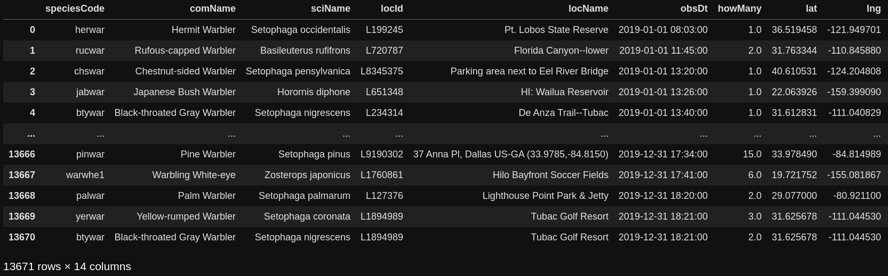

# Warbler Migration

Why warblers?

Warbler's are sensitive to changes in climate, and have well studied migration patterns. They have very predictable migration patterns. Looking at changes in these patterns can be an indicator for climate change.

Every Year, warblers migrate from their winter homes in South America to their summer homes in Canada. 

My goal is to look at the migration patterns from 2013 to 2020 to determine if 2020 was a typical year for warbler spring migration.


## Getting the Data

[Ebird Api Documentation](https://documenter.getpostman.com/view/664302/S1ENwy59?version=latest)


The ebird API supports a handful of requests for recent observation data. Since I was interested in historical data, I was limited to the historic API request. This took in a region code as well as a date. In order to get data from past observations over long periods of time, it was neccessary to write a function to pull each day from a given year. The data pulls came in at about one day every 30 seconds. 

```
https://api.ebird.org/v2/data/obs/{{regionCode}}/historic/{{y}}/{{m}}/{{d}}
```

After running for a few days, I had data for each day from 2013 to 2020. Some pull requests failed during this process. A function was written to check that all days existed and woudlrequest missing days. Another function was used to merge all days from a given year into a CSV. Some processing was done to remove duplicate observations. It appears that some observations were duplicated many times, possibly due to the user pressing submit many times on the same inputs. I was able to confidently remove these duplicates as the observations had both date and time of observation. Only completely identical rows were removed.

A string search was performed on the common names column to filter out any birds that were not warblers. Unused columns were dropped as well.

After removing duplicates, filtering for warblers, and removing N/A results on the 'howMany' columns I ended up with around 13,000 observations per year.



With formatted CSV files for each year, digesting the patterns I am interested in becomes more manageable. 
____________________


## Mapping and Data Exploration


### Confirming Correlation of Observations to Migration

**Do observatios of warblers correlated with the migrations of warblers?**

In theory, the sightings of warblers should move further north as the warblers move towards their home in Canada. I plotted every observation for every day based on latitude and longitude. I used linear regression to plot a line across the US for each day. I then compiled those images into a GIF to visualize my theory.

 


This visualization confirms the theory that observations of warblers increase in latitude along the same time as warbler migrations.

**What does the yearly migration pattern look like?**

Plotting the average warbler observation latitude across every day of the year shows a well defined pattern across all years. Each point represents the average latitude of warbler observations on a given day of a given year.

[](./graphs/5_years_migrations.jpg)


Fit Regression Line to Each Day


Saw clear movement latitudally

Plot of Means each day for 5 years
Overlay to Visualize Trend
No immediately apparent trend

Look at just migration weeks where movement is linear
Plot Regression for each year

Plot all years as one set
Plot Regression
Predict Future Dates


### Might Try

* Fit migration curve

* Look at just migration durations only

* Predit future years 

    * Need more years

    *Need to look at trend from one year to the next

