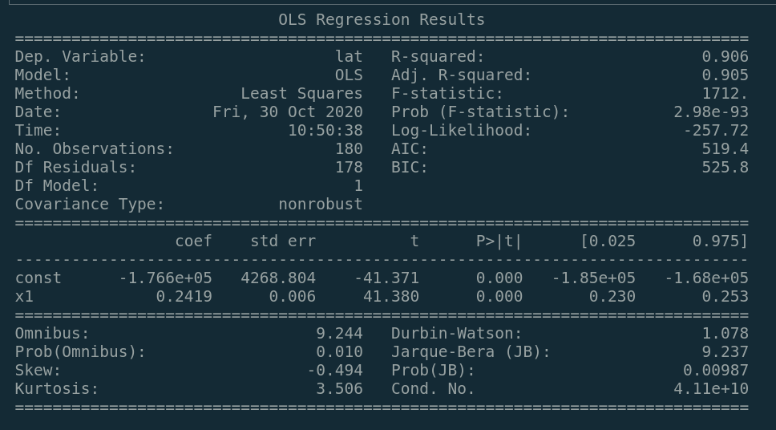

# Warbler Migration EDA


**Why warblers?**

Warbler's are sensitive to changes in climate, and have well studied migration patterns. Looking at changes in these patterns can be an indicator for climate change.

Every year, warblers migrate from their winter homes in South America to their summer homes in Canada. 

The goal is to look at the migration patterns from 2013 to 2020 to determine if 2020 was a typical year for warbler spring migration.
___________

## Ebird Data


[Ebird Api Documentation](https://documenter.getpostman.com/view/664302/S1ENwy59?version=latest)

* The ebird API supports a handful of requests for recent observation data. The plan is to look at historical data, which limited options to the historic API request. 

* This took in a region code and a date. In order to get data from past observations over long periods of time, it was neccessary to write a function to pull each day from a given year. 

* The data pulls came in at about one day every 30 seconds, taking just over 24 hours. 

```
https://api.ebird.org/v2/data/obs/{{regionCode}}/historic/{{y}}/{{m}}/{{d}}
```

* Data was collected from daily observations into yearly datasets. Some pull requests failed during this process. A function ran through each day and appended it to a CSV. A list of missing days was provided to put back through the API request. 

* Duplicate observations needed to be removed to ensure independent data.

* A string search was performed to get a dataset of all warbler observations.
__________________
## Number of Warbler Observations Against Total Observations

* Is there enough data on warblers?


After filtering I ended up with an average of 12,200 warbler observations per year. This provides me with enough to look at all warblers, but looking at individual species of warbler provides too small of a sample size.

### Sample of 2019 Warbler Observation Data


____________________


## Mapping and Data Exploration


**Testing Assumption: Observations of warblers correlate with migration**

The expectation is that observations are recorded further north as the warblers move towards their home in Canada. Plotting every observation on each day based on latitude and longitude assisted in visualizing the migration. Linear regression was used to plot a line across the US for each day predicting where warblers would be on that given day. I then animated the full year to confirm my assumption.

This was done for each year, with each year showing similar patterns.


_______________________________

**What does the yearly migration pattern look like?**

Plotting the average warbler latitude across every day shows a well defined pattern across all years. 

Each point represents the average latitude of warbler observations on a given day. Each year has a unique color.


**Plotting Spring Migration**

After focusing in on spring migration from Apr-7 to May-22 of each year I wanted to visualize the slope of each migration with a regression line to look at differences between years. 

2018 and 2020 had the largest difference with migration in 2018 starting at a lower average lattitude, and ending at a higher average latitude.


**What does the average latitude look like across all years?**

Combining all years into one linear regression visualizes an estimation of the expected latitude on any given day based on migration from 2013 to 2020.





__________________
## Statistical Testing

**Some of these days look like they are far from the mean latitude. A T-test can be used to determine if a given day mean latitude that was the same as the average latitude from 2013-2020.**

#### Null Hypothesis: The mean latitude on a given day is equal to the mean latitude of all observations that day from 2013 to 2020.

#### Alternative Hypothesis: The mean latitude on that given day is not equal to the mean over years 2013-2020.

* April-8 had a point that looked far from the mean latitude so it was an interesting point to observe for the first test. 

* A normal test using scipy stats confirmed that the latitude distribution was not a normal distribution so sampling would be needed.

* Bootstrapping 10,000 samples from April-8 2020 and taking the means of those resulted in a normal distribution of means. The 95% Confidence Interval was calculated and graphed below.


* Doing the same thing on the samples of all observations from 2013 to 2020 provided a normal distribution of the mean latitude on April-8 2020.


Using the Welch's T-test with the assumption of non-equal variances determined that the mean latitude on April-8 2020 was not equal to the mean latitude over all years. 

>Ttest_indResult(statistic=536.5253279869985, pvalue=0.0)

The reported P-Value was 0.0. Graphing to two mean distributions shows that both distributions do not overlap, confirming the test results that there is no probability that the means are the same.


**This raised the question how many days in each year were latitudes not equal to the mean?**

* Automating the test above allowed me to run a T-test for every day of every year from 2014 to 2020 and append the P-Values to a list. 

* The alpha value used to reject the null hypothesis was 0.05. 

* Filtering the list for P-Values under 0.05 and summing those numbers of days over total days observed in that year answered the above question.

```
99.67% of days in 2020 did not have the same mean as all years combined
98.08% of days in 2019 did not have the same mean as all years combined
99.45% of days in 2018 did not have the same mean as all years combined
99.73% of days in 2017 did not have the same mean as all years combined
99.72% of days in 2016 did not have the same mean as all years combined
98.25% of days in 2015 did not have the same mean as all years combined
98.47% of days in 2014 did not have the same mean as all years combined
```

* This test shows that it is not unusal for the mean on any given day to be different from the average latitude. 

_____________________
## Future Exploration


* Additional tests could be performed to determine how many days were within the 95% Confidence Interval of OLS Regression Line from all years. The test above only compares if means are the same. This would give us a better idea of how many days were 95% likely to not be an average day.

* Filter out non-migrating warblers from the dataset. This would make the average latitudes of migrating warblers more pronounced.

* Since warblers migrate from Canada to South America, it would make sense to pull the same data for all of the countries to get a bigger picture.

* Perform tests on fall migrations.

